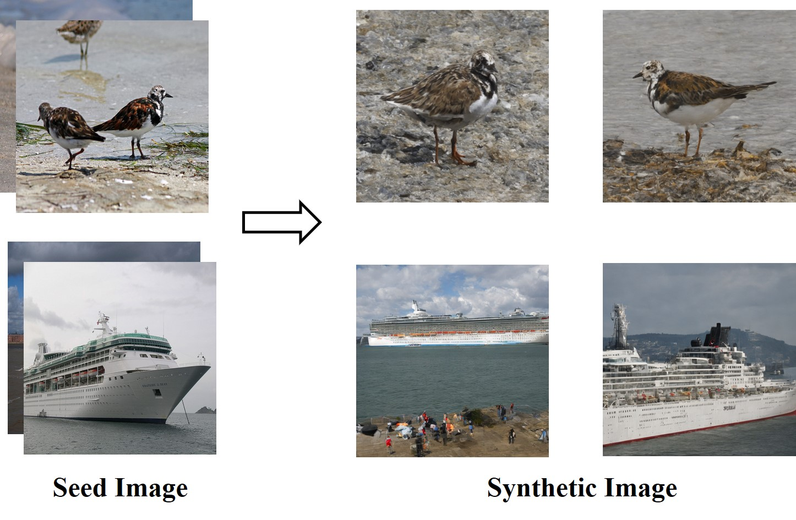

# Backtoor Attacks Framework on Real-world Models
This is the repository for the paper "BadDroid: Backdoor Attack Framework on Real-world Deep Learning Models in Android Apps". It includes the extraction and analysis of real-world models, their conversion, dataset generation, and BadDroid-based backdoor attacks.

## Model Extraction and Analysis

The *model_extraction_analysis* folder contains scripts for extracting and analyzing models. The *bin* folder includes necessary tools such as [Apktool](https://github.com/iBotPeaches/Apktool) and [JADX](https://github.com/skylot/jadx).

`collect.py`: Parses the original collected APK files.  
`decomposeAPK.py`: Decomposes APK files using Apktool.  
`detectorAI.py`: Recognizes DL apps.  
`extractModel.py`: Extracts DL models.  
`interfaceInference.py`: Decompiles APK files using Apktool and JADX.  
`modelLoader.py`: Loads DL models for analysis.  

## Model Conversion

The *model_conversion* folder contains scripts for converting between various model formats. The `schema.fbs` file is a FlatBuffers schema defining the structure of data in ".tflite" files, available at [TensorFlow official](https://github.com/tensorflow/tensorflow/tree/master/tensorflow/lite/schema). By utilizing [flatc](https://github.com/google/flatbuffers), the ".tflite" model is first parsed according to the schema, enabling the extraction and translation of its structure and data into a format compatible with ".pb".

`tflite_2_pb.py`: Converts ".tflite" models to ".pb" models.  
`pb_tflite_2_h5.py`: Converts ".tflite" or ".pb" models to ".h5" models.  
`h5_2_pb_tflite.py`: Converts ".h5" models to ".tflite" or ".pb" models.  
`pb_2_tflite.py`: Converts ".pb" models to ".tflite" models.  

## DataDream-based Data Generation

We use the text-to-image generation tool, [DataDream](https://github.com/ExplainableML/DataDream), to alleviate the data scarcity issue during dataset construction. The *DataDream* folder contains the codes we use for image generation.

`DataDream`: LoRA-finetunes a text-to-image generation model. Path configurations are set in `local.yaml`. Run `bash_run_1.sh`. The fine-tuned model is saved in the folder *outputs*.  
`generate`: Configure paths in `local.yaml`, including the base model path, LoRA-finetuned model path, and output directory for generated images. Then run `bash_run_1.sh`. The generated images are saved in the folder *dataset/generation*. Examples of generated images are shown in Fig. 1.  

  
  
<em>Fig.1: DataDream-generated image examples.</em>

## Baseline Attack Method: DeepPayload

For DeepPayload, the original codes can be found [here](https://github.com/yuanchun-li/DeepPayload). The *deeppayload* folder contains improvements to it.

`trigger_detector.py`: Trains the trigger detector. The trigger detector used in our experiment is `written_T_detector.pb` stored in *deeppayload/resources*.  
`trojan_attack.py`: Performs backdoor attacks on a victim model using the trained trigger detector.  
`pb_model.py`: Defines a `class` to load ".pb" models.  

Hand-written "T" triggers are stored in *deeppayload/resources/triggers/written_T*.  

The overall model structure after DeepPayload attack is shown in Fig. 3.

## Backdoor Attack Effect on Real-world Models and Stealthiness

The *attacks_stealthiness* folder contains scripts for attacking a well-analyzed real-world model, with labels in `label.txt`. The dataset used is [VOC2012](http://host.robots.ox.ac.uk/pascal/VOC/voc2012/).

`poison_benign_image.py`: Accepts a benign sample as input and returns a sample-specific invisible trigger and the corresponding poisoned sample.  
`data_process.py`: Poisons benign samples to generate poisoned samples and changes their label to the target label "sheep".  
`attack_model.py`: Retrains the reconstructed models using mixed data (containing benign training set and poisoned set) to implement backdoor attacks.  

We can also manually reconstruct the model based on its visual structure using [Netron](https://github.com/lutzroeder/netron), such as MobileNet V1 and V2. Based on the analysis and structural visualization of the real-world model, we manually reconstruct the equivalent model, as shown in Fig. 2. 

`image_stealthiness.py`: Selects images, measures their similarity, and evaluates their stealthiness.  
`tflite_evaluate.py`: Evaluates the accuracy of `.tflite` models, verifying the model equivalence based on output and performance before and after model conversion.  
`pb_model_evaluation.py`: Evaluates the classification accuracy of ".pb" models.  

The backdoor trigger generator used by `poison_benign_image.py` is stored in the *generator* folder, with the original file compressed in segments.

  

    

      
       
      <em>Fig. 2: Manually reconstructed MobileNet V2-based model.</em>
    

    

      
       
      <em>Fig. 3: Model after DeepPayload attack</em>
    

  

## ATTACK DEMO on the Real-world Model

We take an APK file as an example to demonstrate the whole process of extracting and analyzing real-world models, reconstructing models, and implementing backdoor attacks (e.g., ISSBA). Set the database path to *apk.db* and the storage path of the APK file to *apk_files*.

First, we automatically parse the APK file to determine whether it is a deep learning app, extract the model, and analyze the basic information of the model, including the input and output node names, shapes, types, etc.

S1: `python collect.py --DB_NAME apk.db --RAW_DATA_PATH apk_files`  
S2: `python decomposeAPK.py --APKTOOL_NAME bin/apktool_2.6.1.jar --DB_NAME apk.db --DST_DIR decomposed --CORE_NUM 5`  
S3: `python detectorAI.py --DB_NAME apk.db --DEC_DIR decomposed --CORE_NUM 5`  
S4: `python extractModel.py --DB_NAME apk.db --DEC_DIR decomposed --MODEL_DIR model`  
S5: `python interfaceInference.py --APKTOOL_NAME bin/apktool_2.6.1.jar --JADX_NAME bin/jadx-1.4.4/bin/jadx --DB_NAME apk.db --DST_DIR decomposed --CORE_NUM 5`  
S6: `python modelLoader.py --DB_NAME apk.db --MODEL_DIR model`

After S1-S6, we can get the extracted model file in the *model* folder. Then determine the output category label based on the relevant information obtained from the analysis. For example, we finally get a well-analyzed real-world model, `test_gpu.tflite`, and its label file is `attacks_stealthiness/label.txt`, which contains 20 categories. We collect data from the VOC2012 dataset according to the categories to provide data preparation for the attack.

We then use [Netron](https://github.com/lutzroeder/netron) to visualize the model structure and reconstruct the model based on the structural information.

S7: `python pb_tflite_2_h5.py --tflite_path test_gpu.tflite --save_path test_gpu.h5` (or reconstruct the model based on the visualized structural information.)  
S8: `tflite2tensorflow --model_path test_gpu.tflite --flatc_path ../flatbuffers/build/./flatc --schema_path ../schema.fbs --output_pb`

Finally, implement backdoor attack, and evaluate the attack results.

S9: `python attack_model.py --image_path VOC2012 --save_path attack_test --number_classes 20 --BARWM_ATTACK`  
S10: `python trojan_attack.py -input_path test_gpu.pb -trigger_detector_path resources/written_T_detector.h5 -trigger_detector_pb_path resources/written_T_detector.pb -output_path hack_test_gpu.pb`  
S11: `python h5_2_pb_tflite.py --h5_path barwm_test_gpu.h5 --tflite_path barwm_test_gpu.tflite`  
S12: `python pb_2_tflite.py --pb_model_path hack_test_gpu.pb --tflite_model_path hack_test_gpu.tflite`  
S13: `python tflite_evaluate.py --tflite_path barwm_test_gpu.tflite --image_path VOC2012`  
(`python tflite_evaluate.py --tflite_path hack_test_gpu.tflite --image_path VOC2012`)
